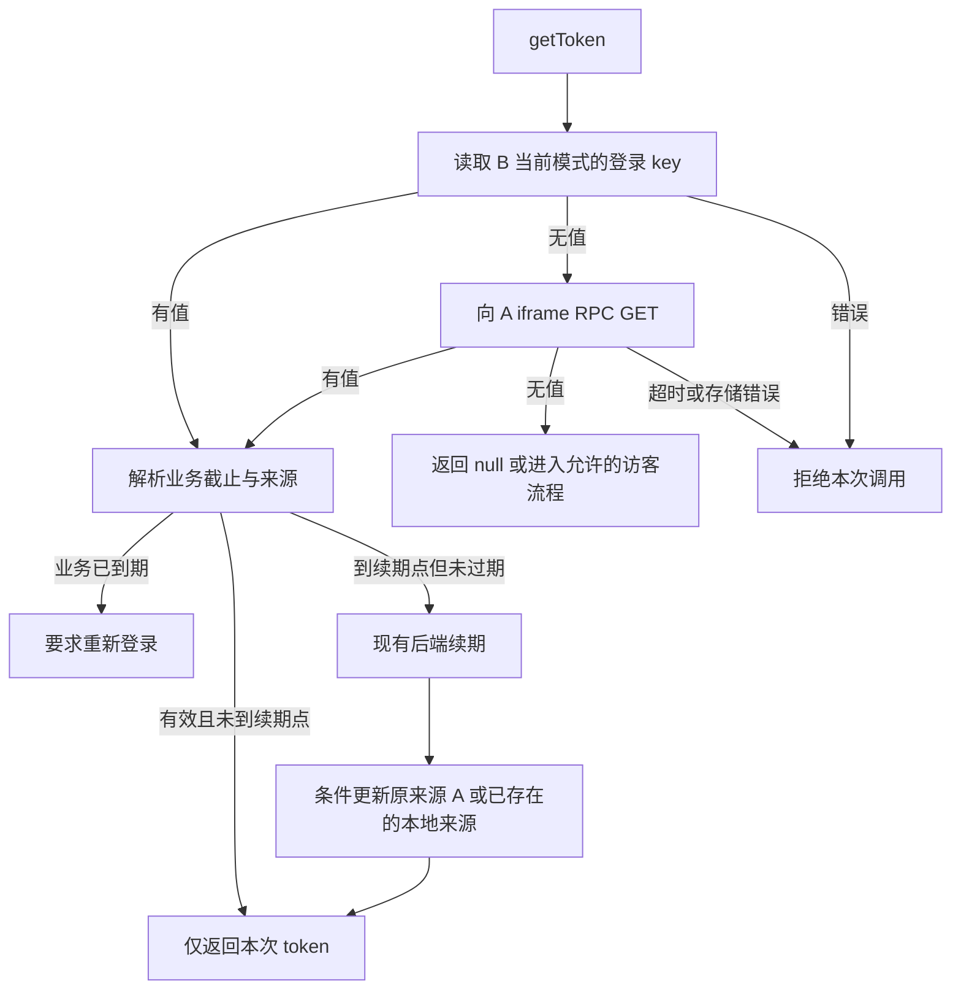

# Design — 可配置存储与本地优先 SSO

日期：2026-09-28。状态：工程设计；业务代码尚未实施。输入以本轮用户确认优先，尤其「RPC 不写回 B」「后端全统一保证」。

## Context

背景见 [proposal.md](proposal.md)。A 是认证站，B 是应用站。跨源包含不同子域；跨站点在本文特指不同根域等不同 schemeful site 的场景，二者不能混用。

| 当前代码证据 | 设计影响 |
| --- | --- |
| `common/src/common/lib/CrosStorage.ts` 构造时立即建 iframe；`getToken` 调用会直接路由到 A 的 `get` | 需要新增真正的 B 本地读取通道，不能把现有 `get` 改名后当作本地读取 |
| `protocol/CrosProtocol.ts` 只有 local/session/automatic；配置非 SESSION 一律当 LOCAL | COOKIE 要贯通配置、适配器、普通/debug 代理；拼写错误不能静默变 LOCAL |
| 当前 RPC 成功本来就没有 token 回写 B | 保持这一性质，不能新增应用 token 缓存 |
| `protocol/LoginUser.ts`、Header 会缓存用户资料；无 token 分支未统一清缓存 | 用户资料只供展示，不能证明登录有效；发现失效后清理派生状态 |
| `Fetcher.ts`、上传、WebSocket 都把 token 交给既有后端鉴权 | 保留 Authorization 原 token 字符串及 WS 握手协议，不切换成 Cookie 自动鉴权 |
| Passport 登录 UI 为 `rememberMe`，API 直接透传；相邻后端源码使用 `remember` | 通过登录适配器统一布尔 wire 字段，不能只实现 Cookie 层而遗漏表单 |
| 四站生产 env 为 HTTPS/WSS 和 LOCAL，使用 Next 静态导出 | 以实际 env、`deploy/build-static.sh` 为准；部分旧说明中的 HTTP、`.mjs` 构建路径已过时 |

后端注销及旧凭证失效由用户确认已统一保证。相邻仓库源码仅作接入线索，不据此推翻线上能力；本方案不新增注销服务、token 黑名单或全局会话系统。实际联调响应需记录在验收报告。

## 业务规则摘要

| ID | 已确认规则 |
| --- | --- |
| BR-01 | 保留 LOCAL、SESSION，新增可配置 COOKIE；无配置默认 LOCAL |
| BR-02 | `getToken` 先读 B 当前模式的本地登录凭证，仅无凭证时走 A 的 iframe RPC |
| BR-03 | RPC token 不写 B 的任何持久存储，也不保留供后续调用复用的内存 token 缓存 |
| BR-04 | 同一浏览器、HTTPS 同根域跨子域必须可用；不同浏览器间共享不在范围内 |
| BR-05 | 不同根域保留 RPC；受浏览器第三方存储限制时不承诺静默登录成功 |
| BR-06 | 记住我勾选：配置业务天数，未配置 14 天；物理 Cookie 截止为业务截止加 1 天。保持当前 UI 默认未勾选 |
| BR-07 | 记住我未勾选：会话 Cookie，不设置 Max-Age/Expires；业务有效期仍由后端决定 |
| BR-08 | 业务有效期内支持后端续期；达到业务截止即不可使用、不可续期，需重登。额外 1 天不是宽限期 |
| BR-09 | 升级要求重新登录，不迁移旧 token；前端不自行延长后端签名中的期限 |
| BR-10 | 后端统一保证鉴权和注销一致性；前端消费结果、清派生状态并完成联调验证 |

## Goals / Non-Goals

目标是可预测的存储读取与生命周期，不把「读到 token」解释为「已通过鉴权」。Cookie 为 JS 可读，签名与会话有效性由后端验证。前端解析 claims 仅用于调度和尽早阻止已知到期凭证，不能代替服务器验签。

不实施跨浏览器同步、OAuth 重定向体系、BFF、HttpOnly 模式或新注销服务。不声称删除 Cookie 会立刻刷新其他已打开页面；保证来自后端的访问失效，前端在下一次读取、恢复焦点或鉴权失败时同步展示。

## Decisions

| 决策 | 选项 A | 选项 B | 选择及理由 |
| --- | --- | --- | --- |
| 读取路线 | 每次都访问 A iframe | B 本地优先，无值访问 A | B；满足用户确定的顺序，共享 Domain Cookie 命中时不依赖 iframe |
| RPC 返回值 | 写 B 降低后续 RPC 次数 | 只返回本次调用 | B；用户明确禁止独立副本，只允许并发中的请求合并，完成即释放 |
| Cookie 域 | 自动取域名最后两段 | 运维显式配置 Domain，空值为 host-only | B；避免公共后缀、测试域及不同根域误判 |
| 读写基础 API | 把通用 `get/set/remove` 都改成本地优先 | 保留原通用路由，token API 独立协调来源 | B；诊断页及调用者兼容，避免“读 B、删 A” |
| 续期落点 | 在收到响应的 B 保存 | 携带本次来源，更新原认证来源 | B；远端来源经 RPC 在 A 更新，B 不留副本 |
| 并发续期 | 所有请求无条件覆盖 | 单页合并 + 权威源条件写入 + 后端续期幂等 | B；防止迟到续期覆盖新登录或恢复已删除状态 |
| Cookie 可读性 | HttpOnly 并更换前端取 token 方式 | JS 可读且继续既有鉴权头 | B；HttpOnly 不满足当前 JS/RPC 获取 token 契约 |
| 跨根域限制 | 自动切换存储/绕过隐私限制 | 返回真实空值或错误，提示重新登录 | B；`postMessage` 不能授予 iframe 额外 Cookie 权限 |
| 退出一致性 | 新建后端注销系统 | 对接用户确认的统一能力 | B；不重复建设，联调验证 HTTP/上传/WS 的失效反馈 |

## Modules

共享代码只改 `common/src/common`，下游通过 `npm run copy` 同步。

| 文件（均相对仓库根） | 职责 |
| --- | --- |
| `common/src/common/lib/Env.ts` | 集中暴露存储、Cookie、命名空间及续期接入配置 |
| `common/src/common/lib/auth/TokenStorageConfig.ts`（新增） | 解析严格配置，验证域、属性组合与凭证版本 |
| `common/src/common/lib/auth/CookieTokenStore.ts`（新增） | document.cookie 编解码、属性、读写删除、容量/拒写检查 |
| `common/src/common/lib/auth/TokenClaims.ts`（新增） | base64url 安全解析、有效期/记住我元数据映射；无验签职责 |
| `common/src/common/lib/auth/TokenLifecycle.ts`（新增） | 来源上下文、有效期、续期合并、身份代号、派生状态通知 |
| `common/src/common/lib/auth/SessionGateway.ts`（新增） | 现有后端续期的接入适配；直接 fetch，避免递归调用 Fetcher |
| `common/src/common/lib/CrosStorage.ts`、`protocol/CrosProtocol.ts` | 本地优先 token API、懒加载 iframe、能力握手与条件更新 RPC |
| `react-next-passport/src/app/(cros)/cros-storage/page.tsx`、`cros-storage-debug/page.tsx` | 共用代理处理器，严格来源校验，A 本地操作不递归 RPC |
| `common/src/common/lib/auth/StorageProxyHandler.ts`（新增） | 两个代理页共用的校验、能力、存储及条件更新处理器 |
| `common/src/common/lib/protocol/LoginUser.ts`、`hook/CrosStorageHook.tsx`、`components/header/user-profile.tsx` | 失效清理、展示更新、页面恢复重读、正确卸载实例 |
| `common/src/common/lib/Fetcher.ts`、`components/file/FileUploader.tsx`、`lib/SparrowWebSocket.ts` | 使用统一 token 生命周期；鉴权失败不复用旧身份，WS 异步失败可恢复 |

依赖方向：配置/底层存储 → RPC 与来源解析 → 生命周期协调 → 请求及 UI。`SessionGateway` 不依赖 `Fetcher`，代理处理器只依赖底层存储，消除 getToken→续期→getToken 循环。

## Configuration

下列新增配置是本 TRD 的设计约定，实施时落入四站 development/production env。`NEXT_PUBLIC_*` 为构建时公开参数，不放秘密。

| 配置 | 类型/默认值 | 校验与用途 |
| --- | --- | --- |
| `NEXT_PUBLIC_TOKEN_STORAGE` | `LOCAL`（默认）/`SESSION`/`COOKIE` | trim 后仅接受三值；显式 `StorageType` 优先，AUTOMATIC 解析默认；错误拒绝启动存储操作 |
| `NEXT_PUBLIC_SSO_CREDENTIAL_VERSION` | `1`（兼容发布默认）/`2`（功能激活） | 1 保持原 LOCAL/SESSION 读取及原 key；2 启用本文本地优先、期限元数据及新命名空间。COOKIE 必须为 2；代理能力可在阶段 1 先升级到 RPC v2 |
| `NEXT_PUBLIC_TOKEN_KEY` | 必填非空原 key | 凭证版本 2 的实际 key 为 `${TOKEN_KEY}:v2`，版本 1 保持原 key；空白/控制字符拒绝。不能在 env 手工再追加 `:v2` |
| `NEXT_PUBLIC_TOKEN_COOKIE_DOMAIN` | 空：host-only | Cookie 权威写入站的合法主机或父域，配置无端口、协议、路径；不允许公共后缀；不自动猜父域 |
| `NEXT_PUBLIC_TOKEN_COOKIE_SAME_SITE` | `Lax` | 只允许 Lax/Strict/None；None 必须 Secure。跨根域嵌入需评估 None，但不能绕过浏览器封锁 |
| `NEXT_PUBLIC_TOKEN_COOKIE_SECURE` | 生产 true，开发按 HTTPS 实际设置 | 生产拒绝 false；Cookie Path 固定 `/`；不设置 HttpOnly |
| `NEXT_PUBLIC_STORAGE_PROXY` | 既有 A 代理 URL | 本地成功不使用；本地无值且不同源时要求配置、HTTPS 生产约束及白名单 |
| `NEXT_PUBLIC_ALLOW_ORIGINS` | 既有精确 origin 列表 | 禁用通配、字符串后缀匹配及 `null` origin；A 和 B 配置配对 |
| `NEXT_PUBLIC_TOKEN_RENEW_URL` | 无默认值 | 现有后端续期接入 URL；凭证版本 2 启用前必须完成配置及契约验证，三种存储共用同一生命周期。地址必须同受信 API origin |
| `NEXT_PUBLIC_CROS_DEBUG` | 生产 false | 即使显式监控也不输出 token、Cookie、Authorization、完整用户信息 |

业务天数使用**后端统一配置**，未配置默认 14；前端不再复制一套可冲突的天数 env。后端返回实际策略与截止时间；前端只决定 session/persistent Cookie 写法。已配置天数必须是可转换为安全时间戳的正数，具体允许小数与否跟随后端配置契约，浏览器收到的截止时间必须为有限安全整数毫秒。

不同根域的 B 本地读取只读取自身可见 Cookie，不尝试把 A 的 Domain 写在 B。Domain 的匹配校验在实际写入 A 时执行；B 不因无法设置 A 域 Cookie 而跳过 RPC。共享子域示例：A=`passport.sparrowzoo.com`，B=`www/admin/im.sparrowzoo.com`，Domain=`sparrowzoo.com`，全 HTTPS，Path=`/`。

## Data Model

```ts
type ConcreteStorage = StorageType.LOCAL | StorageType.SESSION | StorageType.COOKIE;
type TokenSource = {
  location: "local" | "proxy";
  storage: ConcreteStorage;
  key: string;
  authorityOrigin: string;
};
type SessionMeta = {
  sessionId: string;
  issuedAt: number;           // epoch ms
  businessExpiresAt: number; // epoch ms; now >= 此值即失效
  renewAfter: number;         // epoch ms; 由后端续期策略提供
  remember: boolean;
};
type ResolvedToken = {
  token: string;
  source: TokenSource;
  meta: SessionMeta;
  epoch: number;              // 当前页身份操作代号
};
type TokenWriteOptions = { meta: SessionMeta };
type RenewalResult = { token: string; meta: SessionMeta };
type TokenRequestContext = {
  token: string;
  source: TokenSource;
  sessionId: string | null; // 访客为 null
  epoch: number;
};
```

`SessionMeta` 是前端规范化接口，不声明现有后端已经返回这些同名字段。`TokenClaims` 把现有签名中的 `expireAt` 映射为 `businessExpiresAt`；`sessionId/remember/renewAfter/issuedAt` 也必须能从 token 的签名 claims 单独重建，不能只存在于一次登录响应，也不能从未签名 Cookie 附加字段推导授权。登录/续期响应中的 meta 必须与 token 映射一致。登录/续期适配的录制夹具须明确实际字段、时间单位及映射；缺少必要字段时凭证版本 2 不开放发布，禁止猜测。该元数据契约是需联调的集成要求，不影响用户已确认的后端统一鉴权/注销保证。

持久 Cookie 的 `retainedUntil = businessExpiresAt + 86_400_000`；`Max-Age = max(0, floor((retainedUntil - now)/1000))`，同时设置匹配的 Expires。未勾选时两属性均省略。普通读取不能更新这两个值；后端成功续期才可重新计算。JWT 的技术过期可以等于业务截止；Cookie 多保存一天并不要求 JWT 多一天有效。

Cookie 只保存编码后的 token，业务截止由 token 中后端签名信息承载。必须支持现有嵌套 JSON body/base64url；损坏、缺字段或不安全整数报 `TOKEN_INVALID`，不无限回退另一份旧身份。用户资料缓存另用 `${USER_INFO_KEY}:v2`，只供 UI 展示。

## API / Contracts

### Public token API

保留 `CrosStorage` 现有位置及主要调用签名，新增 COOKIE 枚举和可选第三参数：

```ts
getToken(storage?: StorageType, generateVisitorToken?: (() => Promise<string>) | null): Promise<string | null>;
setToken(token: string, storage?: StorageType, options?: TokenWriteOptions): Promise<string>;
removeToken(storage?: StorageType): Promise<string | null>;
```

- 默认 storage=AUTOMATIC，生成器默认 null。所有存储失败一致通过 Promise rejection 返回，不混用同步 throw。
- `getToken` 仅在明确缺少真实登录凭证后走代理；过期、损坏、读权限拒绝不视为缺失。本地有效候选也必须通过后端实际业务鉴权。
- `setToken` 是显式登录写入：A 上写本地；B 上仍走 A 的明确 SET，不因新读顺序在 B 新增登录副本。COOKIE 缺少可验证来源的写入元数据时报 `TOKEN_METADATA_REQUIRED`。
- B 显式切换登录身份时先递增 epoch，并记录 B 原有本地凭证快照。A SET 成功后，按快照条件清理 B 的独立 LOCAL/SESSION/host-only 旧凭证，再报告成功；若 B 看到的本来就是 A/B 共享 Domain Cookie，则 A 更新已经替换同一份值，禁止再删除它。清理失败报告身份切换未完成，不回写新 token 到 B、不让旧本地值遮蔽新身份。A SET 失败时不删除原本地值。
- `removeToken` 先取消本页待完成身份操作，清当前模式 B 可见 key，再尝试删除 A 中同一会话的凭证；共享 Cookie 已删除时 A 空值视为成功。只清本人当前会话，不删除后来登录的新会话；现有后端注销不由此 API 重新实现。
- 续期不调用无来源 `setToken`。内部 `resolveToken(storage): Promise<ResolvedToken|null>`、`renewResolvedToken(resolved): Promise<ResolvedToken>` 保持来源上下文，不能使用易被并发覆盖的 `lastSource` 字段。
- `readLocal`、`writeLocal`、`removeLocal` 直接使用指定 storage，不递归调用跨源通用 get/set/remove。
- 同页并发 GET/续期可共享未完成 Promise；finally 清空引用，后续调用必须重读。业务操作只临时持有返回 token。
- 内部消费者使用 `getTokenContext(storage?, generateVisitorToken?): Promise<TokenRequestContext|null>`，上下文与该次 HTTP/上传/WS 操作绑定；公开 `getToken` 仍只返回 token 字符串。鉴权失败调用 `invalidate(context): Promise<void>`，按 context 的 epoch、来源、expectedToken 条件清理，不能重新读取当前新身份后无条件删除。多个 CrosStorage 实例在同页按认证 origin/凭证版本共用 epoch 与订阅协调器，只共享元数据和在途 Promise，不共享已完成 token 缓存；实例销毁只释放自己的订阅。

### Cookie adapter

```ts
readCookieToken(key: string): string | null;
writeCookieToken(key: string, token: string, options: TokenWriteOptions, config: CookieConfig): void;
removeCookieToken(key: string, config: CookieConfig): void;
```

按编码后的完整 key 精确匹配，以第一个 `=` 分割；键值各编码/解码一次。空值作为无凭证，多个同名可见 Cookie 报 `COOKIE_AMBIGUOUS`，不随机选择。CookieConfig 包含 `domain?:string, sameSite:"Lax"|"Strict"|"None", secure:boolean, path:"/"`。

完整赋值字符串 UTF-8 超过 4096 字节前置拒绝 `COOKIE_TOO_LARGE`；写后读回比对 value，删除使用相同 Domain/Path/名称并验证可见值消失。读回只能检查值，不能证明过期属性正确，属性要通过真实浏览器 Cookie 存储检查。浏览器可提前删除 Cookie，不能把 Max-Age 当作保存承诺。

### RPC v2

保留 requestId/value/error 结构，在 INIT 增加 `protocolVersion:2, capabilities:["local","session","cookie","conditional-write"]`，响应增加 `errorCode?:string`。请求增加可选 `options?:TokenWriteOptions, expectedToken?:string`；SET/REMOVE 的身份条件只比较当前来源存储的旧 token，绝不把 expectedToken 写到日志。

| 消息 | 请求/响应及行为 |
| --- | --- |
| GET | `{command:"get", storage, key, requestId}` → `{requestId,value:string|null,errorCode?}`；A 只本地读取，不创建下一层 iframe |
| SET | 原结构加 options；续期必须有 expectedToken，当前不匹配回 `SESSION_CHANGED`；成功 value 为新 token |
| REMOVE | 当前会话 token 为 expectedToken；不匹配不删除，空值幂等成功 |
| INIT | 由 A 向经白名单验证的父窗口发能力声明，B 校验来源后放行等待的请求 |

生产与 debug 代理共用处理器。A 要求 `event.origin` 在精确白名单、`event.source===window.parent`；B 要求 A 精确 origin、`event.source===iframe.contentWindow`、匹配 requestId/响应结构。发消息只用精确 targetOrigin。请求 key 只允许当前 token/visitor 命名空间及显式诊断 key `hello`，不提供任意敏感存储导出接口。

10 秒整体超时从调用开始计时，包含 iframe ready 等待；销毁/退出及时取消。版本 1 兼容阶段继续支持旧 LOCAL/SESSION GET、SET、REMOVE，保持旧登录与退出可用；COOKIE、条件写入或凭证版本 2 激活必须要求 v2 能力，不满足时拒绝 `RPC_UNSUPPORTED`，不得等到 10 秒再静默回退 LOCAL。iframe 按 origin/代理 URL 复用，不能复用指向其他配置的同 id 节点。

条件写入的能力界限：同一代理实例内检查+写入可串行；不同标签页不是原子 CAS。通过签名 sessionId 检查、执行前重读、后端幂等续期/失效保证阻止授权复活；跨页发生竞态时允许重新登录，不声称浏览器多标签事务一致性。不能把一次旧身份错误自动删除后登录的新身份。

### Existing backend integration

前端统一规范化接口：

```ts
interface SessionGateway {
  renew(input: {token: string; signal: AbortSignal}): Promise<RenewalResult>;
}
```

接入 URL 由 `NEXT_PUBLIC_TOKEN_RENEW_URL` 指定现有受信 API。前端 adapter 默认契约为 POST、Authorization 原 token、JSON 请求体 `{}`、响应 `Result<RenewalResult>`；若现有后端 wire 不同，只在 adapter 映射，不改通用 Fetcher、更不假称此路径已存在。任务 1 的真实脱敏夹具和契约测试固定最终映射后才接入生产。后端未完成可兼容字段时，本前端功能保持关闭；不以模拟测试代替联调。

后端决定 renewAfter，且必须 `issuedAt <= renewAfter < businessExpiresAt`。`now < renewAfter` 不续期；`renewAfter <= now < businessExpiresAt` 在业务请求取 token 时向现有续期能力申请新 token；没有用户业务活动不定时延命。达到业务截止直接要求登录。续期返回的同一会话与新截止必须有效，若没有更晚截止则不伪造新的 Cookie 生命周期。

登录 `rememberMe:boolean` 在 API 边界映射成后端 `remember:boolean`；后端给有效策略，默认业务 14 天。未勾选的业务期限沿用后端规则，Cookie 仅改为会话保存。

### Errors

| 分类/代码 | 对外处理 |
| --- | --- |
| `CONFIG_INVALID` / `RPC_UNSUPPORTED` | 配置或发布不兼容，提示暂不可用并记录脱敏诊断；不切换模式 |
| `STORAGE_DENIED` / `COOKIE_TOO_LARGE` / `COOKIE_WRITE_FAILED` / `COOKIE_AMBIGUOUS` | 登录不得报保存成功；不跳转成假成功，不降级 LOCAL |
| `RPC_TIMEOUT` / `RPC_INVALID_RESPONSE` | 本次调用失败，可由用户重试；不得生成访客或解释为注销 |
| `TOKEN_INVALID` / `TOKEN_EXPIRED` | 当前凭证不可用，按同会话条件清理派生状态，要求重新登录 |
| `SESSION_CHANGED` / `REQUEST_CANCELLED` | 丢弃旧结果；SESSION_CHANGED 最多重读一次当前来源，禁止无限重试 |
| 后端 `user_not_login` / 明确鉴权失败 | 以既有语义归一到 session invalid，清对应身份缓存、停止重连/旧身份请求并引导登录 |
| 续期网络/5xx | 本次请求失败并允许重试，不把错误解释为已注销，不写入任意新存储 |

HTTP、上传、下载、WS 握手都先使用统一 `getToken`。在发送有副作用业务请求前完成需要的续期，不自动重放已发送的 POST/上传。后端拒绝/断开既有 WS 时清状态且不无限使用旧 token 重连；正常 Cookie 更新不会被误认为已更新现存 WS 的鉴权。

## Flows



RPC 来源在 V/U/W/R 全程不得持久化到 B。共享 Domain Cookie 在 B 可读时本来就是同一份凭证，更新它不等于创建 B 私有副本；必须使用相同 Domain/Path/name。A 本身本地无值时直接返回空，不能向自己 RPC。

状态：`idle → reading-local → reading-proxy? → ready | absent | failed`；`ready → renewing → ready | expired | failed`；任一状态可因本页退出/身份切换进入 `cancelled` 并递增 epoch。`expired` 不得转 renewing，只能在新登录后重新开始。失败是暂态；它不是无身份事件。

访客使用独立 `${TOKEN_KEY}:v2:visitor`，只在允许匿名的 IM 等调用提供生成器时使用。先检查真实登录 key 和 A，再考虑访客；不把访客当作本地登录命中，不写覆盖 A 登录 key。生成合并、写入前复查身份及 epoch，保留显式 storage 参数。访客可按其既有功能在 B 单独缓存，该例外只针对新生成访客，不适用于 RPC 返回的任何 token。LOCAL/SESSION 使用 B 对应存储；COOKIE 访客固定为 B host-only 会话 Cookie（不设置 Domain/Max-Age/Expires，Path=/，SameSite/Secure 遵循配置），不复用 A 登录 Cookie 的 Domain 或持久期限。使用独立 `writeVisitorCookie(key:string, token:string, config:Pick<CookieConfig,"sameSite"|"secure">):void`，复用编码/容量/拒写检查，不要求伪造登录 SessionMeta。

退出/失效：开始即递增本页 epoch 并取消当前身份异步结果 → 沿用既有后端统一失效链路 → 按同一会话条件清可见凭证及用户缓存 → 更新 UI/停止旧 WS → 跳转或访客展示。条件清理前后均不允许迟到续期更新存储；旧会话失败不能删除后来登录的新身份。B 没收到 A 的退出事件时，下一次读取或业务鉴权失败处理；窗口 `pageshow`、重新可见时重新读取一次，去重。无持续轮询、无跨域 BroadcastChannel 假设。跨根域 iframe 无权访问时，后端仍拒绝已注销会话。

## Migration Plan

1. 先完成后端真实字段映射、失效/续期联调及同域测试环境，不把本地源码差异自动转成后端开发任务。
2. 第一阶段四站发布兼容 v2 协议和三种模式的前端，设置 `NEXT_PUBLIC_SSO_CREDENTIAL_VERSION=1`，保留 LOCAL 与旧 key 原行为；Cookie 尚不激活。代理普通/debug 同步升级到 v2 能力。
3. 第二阶段四站一致设 `NEXT_PUBLIC_SSO_CREDENTIAL_VERSION=2`，激活 `:v2` 命名空间及 COOKIE、父域配置，清理当前站旧 key 和用户缓存，要求重登。不读取/导入旧 key；访客也用新命名空间。
4. 在 `deploy/build-static.sh` 为四站生成站点内 `sso-release.json`，字段 `protocolVersion, credentialNamespace, storageMode, proxyOrigin, cookieDomain, cookieSameSite, cookieSecure`。`deploy/deploy.sh` 部署前验证匹配和 v2 代理，避免四目录逐个替换期间启用不兼容组合。
5. 在部署根目录保存不随站点覆盖的最小允许命名空间记录；`--rollback` 不得盲选倒数第二个包绕过它。已退役 key 的旧包拒绝部署；需要回滚代码时，以当前有效命名空间重新构建兼容旧逻辑包。禁止重新读旧 LOCAL/token 来“恢复体验”。
6. 静态 HTML/JS 有缓存和已打开旧标签页窗口。前端改 key 本身不能让已加载旧 JS 失效；严格全员重登需由既有后端统一凭证失效能力配合发布，联调确认后实施。无需新建失效系统。

## Verification

| 场景 | 验收断言 |
| --- | --- |
| 三模式/显式参数/默认/拼错 | 正确解析；错误显式失败；没有暗中 LOCAL 回退 |
| 本地命中/无值/RPC 返回/失败 | 命中 0 iframe；无值才 RPC；成功后 B 三种存储均无 token 副本；失败不是 null |
| 同站 HTTPS 子域 | A 登录后 www/admin/im 读取同一 Domain Cookie；禁第三方 Cookie仍不需要 iframe |
| 不同根域 | 允许时 RPC 可读；拒绝时记录真实空值或可识别失败，不声称能区分“未登录”和浏览器静默隐藏 Cookie |
| 默认 14 天业务 | t=业务截止-1ms 可申请续期；t=截止不得使用或续期；Cookie 仍保留至+1天不改变权限 |
| 会话 Cookie/配置天数 | 未勾选无 Max-Age/Expires；勾选按后端配置；浏览器恢复会话不等同业务期延长 |
| 续期来源 | A 来源只更新 A；本地既有来源只更新原范围；失配/拒写不落 B 副本 |
| A 登出、B 本地旧值/在途 RPC/已连 WS | 既有后端拒绝旧会话；B 不恢复缓存身份、不无限重连；记录真实后端证据 |
| 慢访客生成、新登录、双标签续期 | 访客不遮蔽/覆盖真实用户；条件失败重读；跨标签不声称原子CAS |
| Cookie 特殊字符/同名/超长/禁写 | 精确匹配，一次编码，显式异常，不假登录成功 |
| RPC伪造 origin/source/id、debug | 丢弃伪造包；合法错误可追踪；日志无凭证 |
| 升级/回滚 | 强制重登、旧 key 不复活、旧代理拒绝 Cookie、四站清单一致 |

自动化使用单元测试和真实双 origin 浏览器场景；至少以真机 iOS Safari、Android Chrome 普通模式测试同根域 HTTPS，附版本/隐私设置/日期。Playwright WebKit 不代替真机结果；微信内置浏览器单独记录兼容性，不无证据宣称支持。线上问题修复结论只在目标真机复现与回归后给出。

## Risks / Trade-offs

- 第三方 Cookie 被屏蔽 → 跨根域静默 SSO 不能保证；`SameSite=None; Secure` 仅是属性条件，不是权限豁免。[MDN Storage Access](https://developer.mozilla.org/en-US/docs/Web/API/Storage_Access_API/Using)、[WebKit 防跟踪策略](https://webkit.org/tracking-prevention/)。
- JS 可读 Cookie、共享父域扩大可信子域范围 → 保留现有 token 安全边界，仅受信应用加入 allowlist，不把 token 放日志/URL；不假称 HttpOnly 可被 RPC 读取。[Cookie 属性说明](https://developer.mozilla.org/en-US/docs/Web/HTTP/Reference/Headers/Set-Cookie)。
- 物理有效期并非浏览器保存承诺，隐私策略可提前清理 → 读取空值正确进入登录，不承诺“必然保持 14 天”；上线记录真机设置。
- 不缓存 RPC 增加调用次数 → 只合并同时进行的 GET，不保留已完成结果；同根域 Cookie 本地命中规避开销。
- 跨标签写 Cookie 没有天然事务、时钟偏差、迟到结果 → 来源/epoch/条件写入、后端统一鉴权；前端时钟只作预判断，服务端时间与签名为最终准则。客户端时钟偏差大时提示重新登录并记录偏差，不增加业务宽限期。
- 后端真实契约未录制、真机未验收 → 作为实施/发布检查项，不声称本 TRD 已验证功能上线可用。现有后端保证是用户确认事实，具体字段映射仍须测试。

## Delivery

工程规格见本 change 的 `specs/`；实施计划见 [local-first-sso-token-storage.md](../../../superpowers/plans/local-first-sso-token-storage.md)。本文没有实施代码，也没有执行线上操作。
