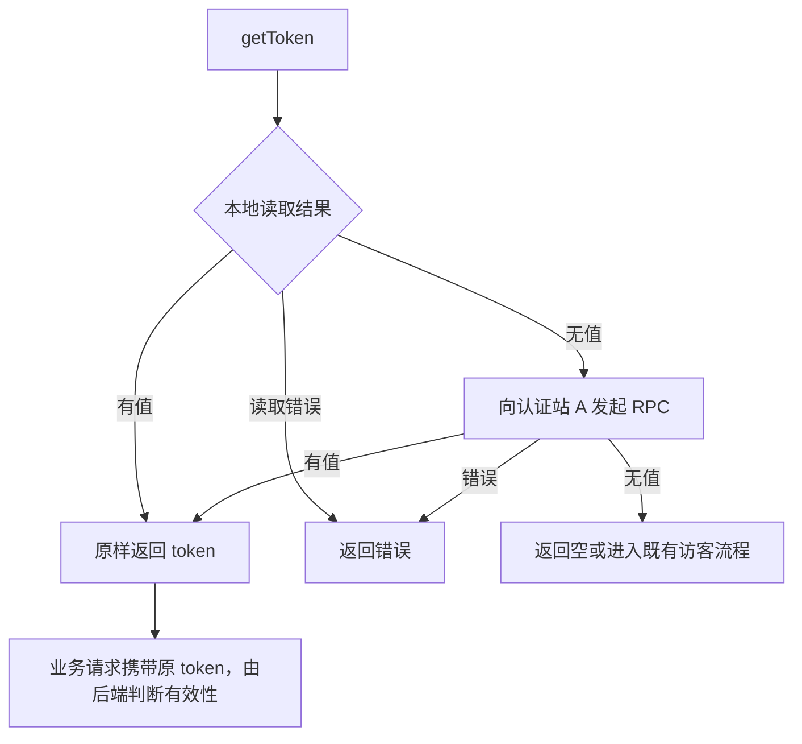

# SSO Token 存储 · 技术设计

<a id="trd"></a>
文档编号：`TRD-req-r01-sso-token-storage`。需求目录：`req-r01-sso-token-storage`。本轮：迭代 `01`，`mode: lite`。

本文完整定义本需求的目标、规则、代码影响、接口、验收与测试要求，可独立阅读和实施。用户确认与代码调查依据见同目录 [evidence.md](evidence.md#confirmations)，任务拆分见 [plan.yaml](plan.yaml)。

用户已确认本轮代码设计并授权实施，进一步明确存储、RPC 与监控须拆分，全部 CRUD 通过统一存储策略复用。实施、测试与剩余验收的实际状态见 `plan.yaml` 和 `evidence.md`；本文定义设计，`plan.md`、`task-status.md` 是生成视图。提交、推送与生产发布另按用户授权执行。

## 本轮目标与范围

让同一浏览器中的应用站 B 先读取本地可见 token，无值时再向认证站 A 请求，增加 Cookie 存储，使同根域子域可直接共享登录凭证。token 始终作为不透明字符串传递，业务有效性和续期由后端处理。

<a id="R01"></a>
### R01 · 三种存储与 Cookie 保存

保留 LOCAL、SESSION，新增 COOKIE；未配置仍为 LOCAL，显式 `storage` 优先。Cookie 按配置的名称、Domain、固定 `Path=/`、SameSite、Secure 保存。编解码仅用于存储往返，读出的 token 必须与写入值逐字节相同，不增加 claims 或包裹结构。

未勾选记住我时使用会话 Cookie；勾选时，从**本次明确保存成功的时点**设置 `(cookieDays + 1) × 86400` 秒，`cookieDays` 未配置为 14。该配置仅定义前端保存期；前端没有后端业务截止，不能宣称保存截止精确等于后端业务截止加一天。普通读取不续写 Cookie，也不承诺随服务端续期自动延长保存期。

<a id="R02"></a>
### R02 · RPC 与认证站归属

沿用现有 GET、SET、REMOVE、INIT 消息及 requestId，增加 COOKIE 和可选保存策略。RPC 通信和监控各自抽为独立类，存储 CRUD 不放在 RPC 内。B 显式写入仍由 A 保存，不在 B 建立 token 副本；普通与 debug 代理处理相同的存储行为。保留精确 origin 校验、指定对端窗口、超时及销毁取消，不引入协议版本或能力协商系统。

<a id="R03"></a>
### R03 · 本地优先且不判断业务有效期

`getToken` 先读 B 所选存储；存在非空值立即原样返回，不创建 iframe、不解析 `expireAt`、不判断业务过期。即使处于额外物理保留日，也返回原 token，由后端决定允许、拒绝或续期。本地成功读取为空才向 A 请求；RPC 结果只返回本次调用，不写 B，也不缓存供后续独立调用复用。

B 与 A 均无值时返回 `null`，受保护入口沿既有流程重新登录。IM 调用明确提供访客生成器时保留既有匿名能力；仅两处无值才执行生成器，生成的访客凭证仍沿既有 A 同 key 写入流程，真实登录会覆盖它，COOKIE 访客默认会话保存。存储拒绝、RPC 超时等错误不视为空值，也不触发访客或静默切换模式。



<a id="R04"></a>
### R04 · 登录选择与最小清理

登录页保持默认未勾选，将 `rememberMe === true` 传给 token 保存接口；不改变现有登录 HTTP 的字段或接口。显式登录成功后，清掉会遮蔽 A 新身份的 B 独立旧值；共享 Domain Cookie 已是同一新值时不得反删。

退出清理 B 当前模式的可见 token，再按既有 A 路由清理源 token；共享 Cookie 已空时删除幂等。成功清理后沿现有 `LoginUser.logout` 清用户资料并跳转。未取得 token 的用户展示分支清掉旧资料，避免仅凭缓存显示已登录。本轮不新增后端注销调用，不承诺已打开的其他标签立即刷新、既有 WebSocket 立即断开或跨标签原子一致性。

<a id="R05"></a>
### R05 · 同步与升级重登

共享实现只改 `common/src/common`，复制到 admin、IM、passport；主站直接使用 common。四站模式、token key、Cookie 属性和代理配置需兼容。升级使用既有 `NEXT_PUBLIC_TOKEN_KEY` 配置切换新 key，不读取或导入旧 token，新页面需要重新登录；不增加 `:v2` 隐式拼接、全站版本发布系统或强制服务端即时撤销。旧已开页面及已签发 token 的后端有效性仍由既有系统控制。

<a id="R06"></a>
### R06 · 浏览器与信任范围

同浏览器、HTTPS、同根域子域共享 Cookie 是必验项。用户已接受父域 Cookie 可被覆盖范围内各子域直接读取；RPC 白名单不缩小 Cookie 的可见范围。不同根域继续尝试 RPC，第三方存储受限可能返回空或失败，风险已接受，实际结果留待上线前后目标浏览器验证。不支持跨浏览器共享登录；当前 JS 读取方案不包含 HttpOnly 改造。

<a id="impact"></a>
## 分流、影响与确认

**lite：** 本轮只做存储、读取顺序及必要接入，业务时效留给后端，规则和调用路径集中；认证风险要求充分回归，不要求恢复整套生命周期设计。**存量改造：** 改变已有 `CrosStorage`、消息协议、登录和退出行为，不能按新增文件判成新需求。

| 已核对源码与当前行为 | 本轮职责与边界 |
|---|---|
| `common/src/common/lib/CrosStorage.ts`：构造时建 iframe，`getToken` 直接 `get(TOKEN_KEY)`；通用操作在跨源时转 A | 仅 token 读取改为本地优先；iframe 延迟到远端操作。通用 `get/set/remove` 的 A 路由保持，token 写删补必要本地清理 |
| `lib/protocol/CrosProtocol.ts` 与 `lib/Env.ts`：只有 LOCAL/SESSION/AUTOMATIC，非 SESSION 默认 LOCAL | 增加 COOKIE、集中 Cookie 配置与可选保存策略，已有调用签名和默认行为兼容 |
| passport 的 `cros-storage/page.tsx`、`cros-storage-debug/page.tsx`：各自处理 LOCAL/SESSION | 两页调用同一底层存储适配，扩展消息字段与 COOKIE；保留界面各自用途，不复制两套规则 |
| passport 的 `[locale]/sign-in/page.tsx`：记住我默认 false，但 `setToken` 未传该选择；`api/signin.ts` 直接转发登录表单 | 只将选择传入保存 API；不猜测后端字段映射、不新增续期 URL |
| `lib/protocol/LoginUser.ts`：退出删 token、删资料；`CrosStorage.locateToken` 无值时未统一清旧资料 | 清理随当前取值与退出结果发生；资料解析只供展示，不能变成前端鉴权判断 |
| `Fetcher.ts`、上传、`SparrowWebSocket.ts` 及 IM `Talk.tsx` 消费既有 token API | 保留请求头、上传、WS 握手及 IM 访客接口；仅做回归和必要空值处理，不重构连接生命周期 |

本轮确认已明确 R01–R06 的行为和上述最小边界；同一问题不重复询问。范围外：前端续期网关、新 token claims、CAS/epoch 协调、即时服务端撤销、独立访客 key、自动版本发布系统。后续若发现必须改变这些边界，仅暂停受影响项并重新确认。

影响角色为登录用户、调用共享库的前端维护者、站点配置与验收人员。主要风险是父域信任范围、浏览器拒写、旧代理不识别 COOKIE、跨根域存储限制；通过明确配置、失败反馈、代理先就绪和真实浏览器验证控制，风险只记录在文档，不向外发送通知。

<a id="api-01"></a>
## API-01 · 配置与 Cookie 适配（R01）

存储类统一位于 `common/src/common/lib/storage/`：`CookieStorage` 只负责 Cookie，`WebStorage` 包装 LOCAL/SESSION，`StorageManager` 按策略统一分发 get/set/remove（set 同时用于创建与更新）。策略遵循同一接口，扩展策略不要求上游复制模式判断。环境变量统一由 `Env.ts` 导出：

| 配置 | 默认与规则 |
|---|---|
| `NEXT_PUBLIC_TOKEN_STORAGE` | 缺省 LOCAL；仅 LOCAL/SESSION/COOKIE，AUTOMATIC 解析此值，非空非法值报配置错误 |
| `NEXT_PUBLIC_TOKEN_COOKIE_DOMAIN` | 缺省 host-only；显式域无协议/端口/路径，写入主机须匹配该域；不自动猜父域 |
| `NEXT_PUBLIC_TOKEN_COOKIE_SAME_SITE` | Lax；支持 Strict/Lax/None，None 必须 Secure；跨根域需按实际环境配置 |
| `NEXT_PUBLIC_TOKEN_COOKIE_SECURE` | 生产 true；开发按实际 HTTPS 配置，生产拒绝 false；Path 固定 `/` |
| `NEXT_PUBLIC_TOKEN_COOKIE_DAYS` | 缺省 14；正整数，计算后的时间须安全有效；记住我保存为配置天数再加 1 天 |

底层策略接口为 `get(key: string): string|null`、`set(key: string, value: string, options?: {remember?: boolean}): string`、`remove(key: string): string|null`，`remember` 缺省 false，配置在实际写入站解析。Cookie 名和值各编码一次、读取解码一次，以完整名称匹配；空值当缺失，多条同名可见 Cookie 报歧义，不任选。仅处理 Cookie 编码损坏，不校验 token 格式、内容或签名。

统一入口 `StorageManager.get(key, storage = AUTOMATIC)`、`set(key, value, storage = AUTOMATIC, options?)`、`remove(key, storage = AUTOMATIC)` 只操作当前浏览器可见存储，返回值分别为值或 null、写入值、删除前值或 null；错误向调用方传播。各策略方法统一命名为 get/set/remove；`resolve` 解析显式或默认模式，`register` 用于扩展/替换策略。构造不访问浏览器全局，实际操作时才访问，避免影响服务端渲染。

`CrosStorage` 保留上游兼容入口，只编排本地/远端路由和 token 规则；不自行实现 Cookie 或 Web Storage CRUD。认证代理同样调用 StorageManager。共享 Cookie 的范围识别与 host-only 清理由存储层提供专用方法，调用方不拼接 Cookie 字符串。

写入先检查编码后容量，完整赋值超过 4096 个 UTF-8 字节拒绝；写后读回必须匹配，失败不报告登录成功。删除使用相同名称/Domain/Path，缺失幂等，删除后仍存在时报失败。未记住省略 Max-Age/Expires；记住时由执行写入的 A 按当前时点与自己的天数配置计算。B 不尝试把 A 的 Domain 写到自身域。浏览器最终保存属性另以浏览器存储面板核验，值读回不能证明属性正确。

<a id="api-02"></a>
## API-02 · RPC 最小扩展（R02）

`common/src/common/lib/rpc/PostMessageRpc.ts` 负责 iframe 的懒加载/复用、就绪、请求关联、对端验证、超时与取消；请求输入含 requestId，返回完整响应，不决定存储策略或 token 有效性。`common/src/common/lib/monitor/StorageMonitor.ts` 负责事件整理、脱敏和回调异常隔离，不执行存储或 RPC。旧的监控类型从 CrosStorage 重新导出以兼容上游。

调用关系：上游 → CrosStorage → StorageManager（本地 CRUD）或 PostMessageRpc（远端）；认证代理 → StorageManager。客户端事件交给独立 StorageMonitor，代理通过封闭的 StorageProxyEvent 回调输出安全摘要；两者均不让监控失败改变业务结果。

`StorageType` 增加 `COOKIE = "cookie"`；现有 `StorageRequest` 增加可选 `saveOptions?: { remember?: boolean }`，缺省等同 false，仅 SET 的 COOKIE 分支使用；字段存在时须为布尔值，非法类型返回错误。请求 `command/storage/key/requestId/value` 和响应 `requestId/value/error` 不变；不加新版本、签名元数据、条件写入或续期命令。

普通/debug 页面共同调用 `rpc/StorageProxy.ts`，按现有路由读取 A 本地适配器，SET 把保存策略交给 CookieStorage，GET/REMOVE 不生成新保存期限。LOCAL/SESSION 沿现有行为，GET 返回值或 null，SET 返回写入值，REMOVE 返回原值或 null；存储错误通过现有 error 返回，不变成 null。代理只接收精确白名单 origin 且 `event.source === window.parent` 的请求；B 校验认证 origin、`event.source === iframe.contentWindow` 和 requestId，targetOrigin 用精确值。

保留现有 10 秒请求整体超时和 `destroy()` 取消；最后一个请求完成或失败后解除该实例的监听，下一次请求按已验证的 iframe 状态重新接入，避免临时消费者累积监听。普通/debug 的诊断只保留命令、结果类别和长度等信息，不输出完整凭证；四站生产关闭 CROS_DEBUG。新客户端启用 COOKIE 前须部署两种代理并验证字段支持；旧代理兼容仅限其原 LOCAL/SESSION 行为，不承诺其能处理 COOKIE，也不自动降级掩盖不兼容。

<a id="api-03"></a>
## API-03 · getToken（R03）

签名保持 `getToken(storage = AUTOMATIC, generateVisitorToken = null): Promise<string|null>`。实现顺序：解析所选模式 → 直接读取 B 该模式 → 非空立即原样返回 → 确认本地为空后按既有 GET 向 A 读取 → 返回 A 值；A 本身无值时直接为空，不向自己请求。

构造阶段不创建 iframe，也不以代理可达性作为本地读取前提；确需跨源操作时才校验代理地址并初始化 iframe。底层本地读不递归调用通用跨源 get。各次已完成 RPC 结果均释放，不新增长期 token 缓存，读取不调用 setToken、不写 Cookie。

两处为空且有访客生成器时，沿既有流程生成并 `setToken(visitorToken, storage)`，显式模式须贯穿，COOKIE 默认会话保存；无生成器返回 null，由调用方维持其登录跳转或匿名展示。读失败直接拒绝本次调用，不能误触发重登、访客或备用存储。后端拒绝 token 时继续既有 `user_not_login` 等处理，不在此 API 提前拦截业务过期。

<a id="api-04"></a>
## API-04 · 登录、保存与退出（R04）

`setToken(token, storage = AUTOMATIC, saveOptions?: {remember?: boolean})` 增加可选第三参数，旧调用继续有效。A 同源写本地，B 显式写入通过现有 SET 交 A；LOCAL/SESSION 忽略 Cookie 保存选项，成功返回原 token。登录页调用时传 `{remember: data.rememberMe === true}`，先等保存成功再提示与回跳，失败保留错误反馈。

为贯穿保存选项，通用 `set(value,key,storage,saveOptions?)` 增加可选尾参数，原参数、返回及路由不变；get/remove 无需改变公共签名。B 写入 A 成功后清掉本次所选模式下的独立旧凭证；A 写失败时不清旧值。Cookie 是否同一份须根据 A/B origin 与已配置 Domain/Path/name 判断，不能仅比较 token 值；共享 Cookie 不再删除，跨根域仅清 B 实际拥有的独立范围，不能尝试写 A 域。同名不同范围无法明确判定时报告歧义，不能盲删。清理失败不得报告身份切换完成，不通过在 B 保存新 token 补救。

`removeToken(storage = AUTOMATIC): Promise<string|null>` 先读取并清 B 当前模式可见值，再沿原 remove 路由清 A；A 同源只清一次。共享 Cookie 在前一步已清时 A 返回空属于成功。返回本次已删除的 B 原值，否则返回 A 原值，均无值返回 null。任何实际清理失败明确失败；不新增后端注销接口或将多步删除声称为事务。

`LoginUser.logout` 保留成功后清资料和跳转；`locateToken` 等实际无 token 的展示入口清 `USER_INFO_KEY`，不依赖资料缓存判断有 token。Header 只按本次读取结果显示账户；读取失败显示错误与重试，不生成访客或清掉未知状态的资料，确认无 token 才显示访客；`CrosStorageHook` 的卸载清理销毁本次创建的实例，不读取初次渲染捕获的空 state。Fetch、上传、WS 保留原 token 的传输形式。并发登录/退出沿现有处理，无跨标签 CAS 或即时撤销保证；不得把这类保证写成已通过验收。

<a id="api-05"></a>
## API-05 · 同步与发布交接（R05）

实现回源 common，按各子项目 `yarn copy` 同步，并构建 common、admin、IM、passport。四站配置按已有 env 方式维护；Cookie 天数由实际保存站 A 执行，B 不另行推导后端期限。

Passport 的 `@/common` 指向自己的 `src/common` 副本。T02 测试新代理前、T04 测试新登录接入前都须先执行 Passport copy；T05 再做四站最终同步。副本不得手改，copy 带来的协议、用户资料与 hook 文件一并纳入任务范围。

目标生产父域为 `sparrowzoo.com`，站点保持 HTTPS，Cookie 使用 Path=/、Secure、SameSite=Lax。同根域验收不依赖第三方 Cookie；跨根域配置需要允许 Cookie 被第三方读取时使用 None+Secure，仍可能受浏览器限制。本地 HTTP localhost 开发统一使用 COOKIE，Domain 留空形成 host-only Cookie，Secure=false、SameSite=Lax；Cookie 不隔离端口，所以 localhost 各端口可共享。真实跨子域验收仍使用受控 HTTPS 子域夹具，不能把两个 localhost 端口等同于跨子域验收。

升级重登通过显式变更既有 TOKEN_KEY 落实，本轮四站配置值统一为 `sparrow_sso_token`；旧值 `Authorization` 不读取。名称仅来自配置，不硬编码或隐式追加版本号。先验证普通/debug 代理支持 Cookie，再启用相同配置的新页面；旧 key 不读取、不复制。发布和回滚均沿已有工具，回滚时保留本轮新 key，不能为了恢复体验再读取旧凭证。已有打开页面不能仅靠换 key 强制退出，服务端对既有 token 的处理不在本轮前端改造内。

<a id="api-06"></a>
## API-06 · 验收环境与证据（R06）

浏览器自动化使用真实双 origin 页面验证读写与 RPC，至少覆盖同根域 HTTPS 子域、跨根域允许与受限两类环境；真机 iOS Safari、Android Chrome 记录浏览器/系统版本、隐私设置、域配置和日期。受限环境如实记录空值或错误，不以模拟 viewport、自动化 WebKit 或结构检查宣称真机通过。实际生产问题是否修复，仍需对应故障环境复现与回归。

<a id="acceptance"></a>
## 验收场景

```gherkin
Feature: 本地优先的可配置 SSO token 存储
  @R01 @S01
  Scenario: 三种存储保持原 token
    Given 分别选择 LOCAL、SESSION、COOKIE 并写入包含等号与百分号的原 token
    When 读取后删除该值
    Then 读取和删除返回的 token 与输入完全相同且随后读取为空

  @R01 @S02
  Scenario: 持久 Cookie 只按明确保存时点计算
    Given COOKIE 保存选择记住我且保存天数未配置或明确配置为正整数
    When 保存 token 后反复读取
    Then 首次保存期为配置天数加一天且未配置使用十四加一天
    And 后续读取不改变保存期限也不读取 token 中的业务截止

  @R01 @S03
  Scenario: Cookie 失败不伪装为空或成功
    Given Cookie 配置非法、超过容量、被拒写或存在同名歧义
    When 对该 Cookie 执行相关存储操作
    Then 操作明确失败而不切换为其他存储

  @R02 @S04
  Scenario: RPC 在认证站保存 Cookie
    Given B 使用 COOKIE 且选择记住我
    When B 通过 SET 向 A 写入 token
    Then A 按其配置保存原 token 和对应属性且 B 不新增副本
    And 普通与 debug 代理给出相同存储结果

  @R02 @S05
  Scenario: RPC 失败与消息来源可区分
    Given 请求收到错误窗口、错误 origin、错误 requestId 的消息或发生超时
    When B 等待认证站读取结果
    Then 不将伪造消息或超时解释为正常 token 或空值

  @R03 @S06
  Scenario: 本地仍有值就直接返回
    Given B 本地有原 token 即使后端业务期已过或处于额外保留日
    When 调用 getToken
    Then 原 token 被直接返回且没有 iframe 或 RPC 请求
    And 前端不解析业务期限或申请续期

  @R03 @S07
  Scenario: 本地为空后仅使用本次 RPC 结果
    Given B 本地为空且 A 有 token
    When B 连续独立调用两次 getToken
    Then 每次都查询 A 且返回原 token
    And B 的存储中没有 RPC 结果副本或可复用的已完成结果缓存

  @R03 @S08
  Scenario: 两处缺失后保留受保护和匿名入口区别
    Given B 和 A 均成功返回无 token
    When 受保护入口与提供访客生成器的 IM 入口分别获取 token
    Then 前者返回空并沿现有流程重登而后者生成并保存访客 token
    And 显式 storage 参数贯穿访客保存且 COOKIE 访客为会话保存

  @R04 @S09
  Scenario: 登录选择决定 Cookie 保存形式
    Given 登录表单默认未勾选记住我
    When 用户分别保持未勾选或明确勾选后登录成功
    Then 未勾选的 Cookie 不含 Max-Age 与 Expires 而勾选的 Cookie 使用配置保存期
    And 保存失败时不显示登录成功或回跳

  @R04 @S10
  Scenario: 新登录不会被独立旧值遮蔽
    Given B 有独立旧值或与 A 共用同一 Domain Cookie
    When B 在 A 成功保存新的登录 token
    Then 清掉独立旧值但不删除已替换为新 token 的共享 Cookie

  @R04 @S11
  Scenario: 退出清除当前可读来源和资料
    Given B 本地或 A 当前模式中存在 token 且页面有用户资料
    When 用户退出并且清理成功
    Then B 和 A 的目标凭证均不可再读且本页资料清除并跳转
    And 共享 Cookie 已空时删除仍成功而真实删除失败仍报告错误

  @R05 @S12
  Scenario: 同步发布后新页面要求重新登录
    Given 四站共享代码与 Cookie 配置兼容且部署使用统一新 TOKEN_KEY
    When 新页面只存在旧 key 的 token
    Then 不读取或导入旧 token 并要求重新登录
    And 回滚交接仍使用本轮 key 且不宣称旧已开页面已即时失效

  @R06 @S13
  Scenario: 同根域子域通过真机验收
    Given 同浏览器 HTTPS 下 A 与 B 共享已确认父域 Cookie
    When 真机在 A 登录后访问 B
    Then B 直接读取同一 token 且证据包含环境和实际结果

  @R06 @S14
  Scenario: 跨根域限制如实记录
    Given A 与 B 属于不同根域且浏览器可能限制第三方存储
    When B 本地无值后尝试 RPC
    Then 记录真实返回值、空值或错误而不承诺所有手机静默登录成功
```

<a id="test-strategy"></a>
## 验证与交付

测试按 RED → 最小实现 → GREEN 推进，加载实际生产模块，不能用复制的实现证明自身正确。`plan.yaml` 逐任务固定测试文件、命令和 S 编号；实际结果、环境限制和复验记录维护于 evidence.md，规划命令本身不构成通过证据。

单元与接口回归分别覆盖 Cookie 配置/编解码/属性、RPC、读取顺序、登录/退出。自动化多 origin 验证真实 Cookie 与 postMessage；人工真机验证由验收任务单列，缺设备或未执行时保持未验证，不以构建通过代替。

| 任务 | 拟建立的测试入口与场景绑定 |
|---|---|
| T01 | Common 的 `test:auth` 使用 Vitest 与 DOM 测试环境，加载真实 TypeScript 模块；`tests/auth/cookie.test.ts` 对应 S01–S03 |
| T02 | Common 的 `tests/auth/rpc.test.ts` 验证客户端；Passport 首次建立独立 `test:auth` 与 `tests/auth/proxy.test.tsx`，在自身 React/别名环境挂载真实普通/debug 代理，二者共同对应 S04–S05；延迟 iframe 在 S06 回归 |
| T03 | `tests/auth/read.test.ts` 对应 S06–S08；`tests/auth/consumers.test.ts` 断言 Fetcher、上传与 WS 保持原 token，不增加续期调用 |
| T04 | Common 的 `tests/auth/login-state.test.ts` 对应 S10–S11，补 hook 卸载与访客被真实登录覆盖；Passport 沿用 T02 建立的入口，`tests/auth/login.test.tsx` 对应 S09 |
| T05 | `tests/auth/release-config.test.ts` 对应 S12，核对新旧 key 隔离及配置；实际 copy/build 单独执行 |
| T06 | Common 建立 Playwright `test:auth:e2e`，`tests/auth/e2e/sso.spec.ts` 对应 S13–S14，并在浏览器验证 S02/S07/S09/S11；实际同根域真机记录写入 evidence |

上述测试入口已经建立，实际结果以 evidence.md 为准。依赖安装统一使用 Yarn，保留各宿主的 yarn.lock。Vitest 配置将单元测试与 `e2e/` 分开，按宿主解析 `@/`，不直接导入不相关 Next 页面；Passport 使用自身 React 环境。浏览器夹具加载实际客户端及代理实现，可模拟后端成功/失败以验证前端，但真实后端联调结果须另外注明。测试名称包含 S 编号；每个行为任务的 RED 必须来自行为断言失败，缺依赖/不存在的脚本不能算 RED。

T06 的自动化命令不代替真机：标为 done 前，至少记录 iOS Safari、Android Chrome 的同根域实际结果。跨根域成功、失败或未验证均如实记录，已接受的浏览器限制不阻塞同根域交付；本轮不执行生产发布。

RIGHT-BICEP：**Right** 断言原 token、来源与记住我结果；**Boundary** 覆盖空值、默认/非法天数、额外保留日、同名和容量边界；**Inverse** 校验写读一致、写删后为空；**Cross-check** 用浏览器存储属性独立核对保存期，并验证实际请求仍发送原 token；**Error** 注入拒写、RPC 伪造/超时和删除失败；**Performance** 以本地命中零 iframe/零 RPC、远端请求遵循现有超时为守护基线，不虚设响应毫秒指标。

人工与自动化证据不得记录完整 token、Cookie、Authorization 或用户隐私。最终交付说明本轮实现与未完成范围、实际验证和发布状态；四列任务状态表仍仅为任务编号、名称、状态、备注。
