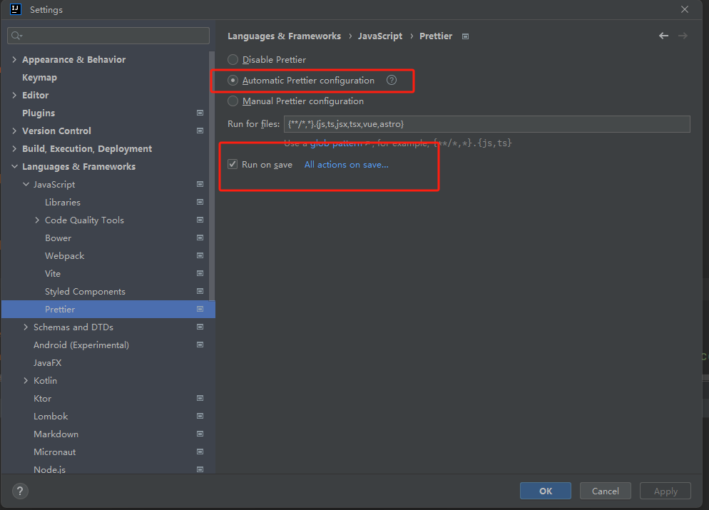

# tailwindcss 
## Prettier
https://prettier.io/
## Automatic class sorting with Prettier
https://tailwindcss.com/docs/editor-setup

## 如何排序的？
https://tailwindcss.com/blog/automatic-class-sorting-with-prettier#how-classes-are-sorted

## 插件官方源码
https://github.com/tailwindlabs/prettier-plugin-tailwindcss
## prettier 插件配置
https://prettier.io/docs/en/configuration.html

```agsl
Customizing your Tailwind config path
To ensure that the class sorting takes into consideration any of your project's Tailwind customizations, it needs access to your Tailwind configuration file (tailwind.config.js).

By default the plugin will look for this file in the same directory as your Prettier configuration file. However, if your Tailwind configuration is somewhere else, you can specify this using the tailwindConfig option in your Prettier configuration.
默认情况下会在配置文件当前目录下查找tailwind 配置文件，如果tailwind配置文件不在同级目录下，则做如下配置
Note that paths are resolved relative to the Prettier configuration file.

// .prettierrc
{
  "tailwindConfig": "./styles/tailwind.config.js"
}
If a local configuration file cannot be found the plugin will fallback to the default Tailwind configuration.
```

# IDEA 配置

This plugin adds support for Prettier (https://prettier.io), an opinionated code formatter. 
## To use it:
- Add prettier to your project with npm install prettier --save-dev or install it globally
- Select the code or file you want to format using Prettier
- Use the "Reformat with Prettier" action (Alt-Shift-Cmd-P on macOS or Alt-Shift-Ctrl-P on Windows and Linux) or find it using the "Find Action" popup (Cmd/Ctrl-Shift-A)
- To run Prettier on save, tick the "Run on save for files" option in Preferences/Settings | Languages \& Frameworks | JavaScript | Prettier.  Please report any issues in the issue tracker.
## Getting started
Support for Prettier (https://prettier.io), an opinionated code formatter. How to use it:

- Add prettier to your project with npm install prettier --save-dev or install it globally
- Select the code or file you want to format using Prettier
- Use the “Reformat with Prettier” action (Alt-Shift-Cmd-P on macOS or Alt-Shift-Ctrl-P on Windows and Linux) or find it using the “Find Action” popup (Cmd/Ctrl-Shift-A)
- To run Prettier on save, please configue and use File Watchers as described here. This plugin is compatible with IDE versions starting with 2018.1.

